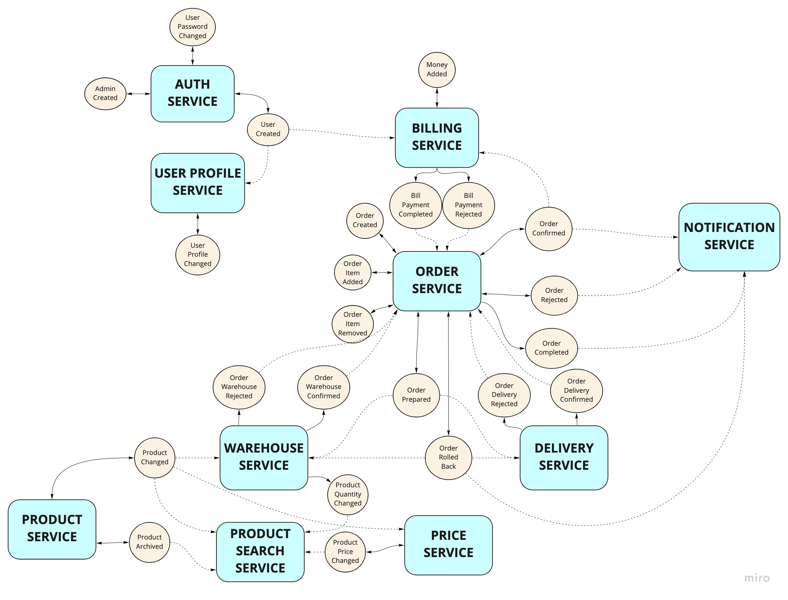

# Otus Architect

Homework Otus Architect

## Описание архитектуры
Основные компоненты системы:
- NGINX Ingress - используется как точка входа для всех API. Настроен на Host - arch.homework и префиксы для всех урлов /otusapp/alapitskii
- KrakenD - используется в качестве шлюза запросов. Задачи - переадресация запросов на соответствующие Backend сервисы, первичная валидация JWT токена, объединение ответов от Backend сервисов для отображения в API
- Auth Service - сервис для работы с аутентификационными данными пользователей. Предоставляет API аутентификации и управления логином/паролем пользователя
- User Profile Service - сервис для работы с контактными данными пользователей. Предоставляет API получения/изменения контактных данных пользователя.
- Billing Service - сервис для работы со счетами на оплату. Позволяет оплачивать подтвержденные пользователем заказы
- Orders Service - сервис для работы с заказами. Позволяет изменять список товаров в заказе, управляет статусом заказа и составными частями заказа в других сервисах (доставка, резервирование)
- Product Service - сервис с товарами. Предназначен для получения описаний товаров и поиска
- Price Service - сервис цен за товары. Предназначен для работы с ценами за товары с учетом разного количество товарных позиций
- Notification Service - сервис уведомлений клиента. Формирует сообщения в ответ на события в других сервисах

  
### Ключевые решения
- Взаимодействие сервисов выполняется через Event Store (Kafka)
  
- Пользователи идентифицируются единым ИД в обоих сервисах Auth Service и User Profile Service
- Регистрация пользователя выполняется в 2 этапа:
  - создание пользователя с логином/паролем в Auth Service
  - первичное создание профиля пользователя в User Profile Service (после логина)
- Изменение пароля и изменения профиля являются разными операциями и выражены разными методами в API
- Определение ИД пользователя при роутинге запросов к сервису User Profile Service выполняется на шлюзе из JWT токена
- Большинство обработчиков событий - идемпотентны (к примеру, обработчик событий по заказам в сервисе уведомлений проверяет, что уведомление определенного типа для заказа еще не отправлялось)
- Цены на товары генерируются рандомом в сервисе Orders Service

## Сценарии
### Работа с заказом
Сценарии работы с заказами (создание/оплата/отмена) описаны в виде Sequence диаграммы
#### Реализованный вариант (Event Sourcing)

#### Альтернатива (Синхронное взаимодействие сервисов)
(!!!) Альтернативный вариант актуален для простого сценари работы с заказами (без списка позиций, доставки и т.д.) 

#### Альтернатива (Transactional Outbox и асинхронные уведомления)
(!!!) Альтернативный вариант актуален для простого сценари работы с заказами (без списка позиций, доставки и т.д.

## Сборка
* `cd src`
* `docker build -t antlapit/otus-architect-auth-service:v4 -f Dockerfile.auth .`
* `docker build -t antlapit/otus-architect-user-profile-service:v4 -f Dockerfile.users .`
* `docker build -t antlapit/otus-architect-order-service:v4 -f Dockerfile.order .`
* `docker build -t antlapit/otus-architect-billing-service:v4 -f Dockerfile.billing .`
* `docker build -t antlapit/otus-architect-notification-service:v4 -f Dockerfile.notification .`
* `docker build -t antlapit/otus-architect-price-service:v1 -f Dockerfile.price .`
* `docker build -t antlapit/otus-architect-product-service:v1 -f Dockerfile.product .`

## API
* в каталоге **examples** есть Postman коллекция
* в коллекции есть 2 каталога: Local (для локальной разработки) и K8s (для kubernetes - для корректной работы требуется явно передавать хост arch.homework в curl или прописать его в hosts)

## Развертывание компонент системы 
* **Отдельный namespace** `kubectl create namespace alapitskii`
  * `kubectl config set-context --current --namespace=alapitskii`

Установка всех helm зависимостей
* `sh ./scripts/install_helm_dependencies.sh`

Единый скрипт для установки
* `sh ./scripts/install.sh`

Единый скрипт для удаления
* `sh ./scripts/uninstall.sh`

### Прикладные сервисы
* **Сервис данных о профиле пользователя** `helm install user-profile-service-release deployments-helm/user-profile-service`
* **Сервис аутентификации/авторизации** `helm install auth-service-release deployments-helm/auth-service`
* **Сервис заказов** `helm install order-service-release deployments-helm/order-service`
* **Сервис счетов** `helm install billing-service-release deployments-helm/billing-service`
* **Сервис уведомлений** `helm install notification-service-release deployments-helm/notification-service`
* **Сервис товаров** `helm install product-service-release deployments-helm/product-service`
* **Сервис цен** `helm install price-service-release deployments-helm/price-service`
* **Шлюз KrakenD** `helm install krakend deployments-helm/krakend`

**Состав релиза**  
* развертывание postgresql из официального чарта
* развертывание прикладных сервисов
* для каждого сервиса выполняются стартовые миграции за счет job, который удаляется после релиза
  * миграции выполняются самим сервисом при наличии переменной окружения SERVICE_MODE=INIT
  * докер образ для job и сервиса один
  
### Мониторинг
* установка Prometheus `helm install prom prometheus-community/kube-prometheus-stack -f deployments/prometheus.yaml --atomic`
* обновление стандартного nginx `helm install nginx ingress-nginx/ingress-nginx -f deployments/nginx-ingress.yaml`
* установка postgresql-exporter
  * для БД пользователей `helm install postgres-exporter-users prometheus-community/prometheus-postgres-exporter -f deployments/postgresql-exporter-users.yaml`
  * для БД аутентификации/авторизации `helm install postgres-exporter-auth prometheus-community/prometheus-postgres-exporter -f deployments/postgresql-exporter-auth.yaml`
  * для БД заказов `helm install postgres-exporter-order prometheus-community/prometheus-postgres-exporter -f deployments/postgresql-exporter-order.yaml`
  * для БД счетов `helm install postgres-exporter-auth prometheus-community/prometheus-postgres-exporter -f deployments/postgresql-exporter-billing.yaml`
  * для БД уведомлений `helm install postgres-exporter-notification prometheus-community/prometheus-postgres-exporter -f deployments/postgresql-exporter-notification.yaml`
  * для БД товаров `helm install postgres-exporter-price prometheus-community/prometheus-postgres-exporter -f deployments/postgresql-exporter-price.yaml`
  * для БД цен `helm install postgres-exporter-product prometheus-community/prometheus-postgres-exporter -f deployments/postgresql-exporter-product.yaml`
  
### Prometheus & Grafana
* форвардинг портов grafana `kubectl port-forward service/prom-grafana 9000:80`
* dashboard grafana http://localhost:9000
* логин/пароль - admin/prom-operator
* форвардинг портов prometheus `kubectl port-forward service/prom-kube-prometheus-stack-prometheus 9090`

### Шлюз KrakenD
* форвардинг портов KrakenD `kubectl port-forward service/krakend 10000:80`

### Дашборд Grafana
Основной Dashboard - `grafana/dashboard.json`

Содержимое дашборда (параметр - имя сервиса)
* метрики с сервиса
  * Latency по квантилям 0.5, 0.95, 0.99, 1.0 с разбивкой по методам API
  * 5xx ошибки с разбивкой по методам API
  * RPS с разбивкой по методам API
* метрики с nginx
  * Latency по квантилям 0.5, 0.95, 0.99, 1.0 (+ alert-ы в Telegram)
  * 5xx ошибки (+ alert-ы в Telegram)
  * RPS
* CPU и Memory по pod-ам 

Метрики PostgreSQL - `grafana/dashboard_postgresql.json`

## Тестирование сценариев
Запуск сценариев с помощью newman: `newman run examples/OTUS\ Architect.postman_collection.json`.
В коллекции 3 сценария:
- `Register`:
  - Регистрация пользователя
  - Проверка, что профиль недоступен без аутентификации
  - Проверка, что первичное создание профиля недоступно без аутентификации
  - Проверка, что изменение профиля недоступно без аутентификации
  - Логин
  - Первичное создание профиля
  - Получение профиля
  - Изменение профиля
  - Проверка измененного профиля
- `Password Changing`:
  - Регистрация пользователя
  - Проверка, что изменение пароля недоступно без аутентификации
  - Логин
  - Изменение пароля (старый пароль указан неверно)
  - Изменение пароля
  - Логин с новым паролем
- `Profile Visibility`:
  - Регистрация пользователя 1
  - Логин пользователя 1
  - Проверка профиля пользователя 1
  - Регистрация пользователя 2
  - Логин пользователя 2
  - Проверка профиля пользователя 2
- `Full Order Scenario`:
  - Регистрация пользователя
  - Логин пользователя
  - Получение профиля
  - Создание заказа
  - Добавление позиции в заказ
  - Подтверждение оплаты (денег хватает)
  - Добавление денег на счет
  - Проверка денег на счету
  - Проверка остатка на счету
  - Проверка отправленного уведомления
- `Order Item Changing`:
  - Регистрация пользователя
  - Логин пользователя
  - Получение профиля
  - Создание заказа
  - Добавление позиции в заказ
  - Добавление второй позиции в заказ
  - Частичное удаление второй позиции из заказа
  - Проверка общей стоиммости заказа
- `Reject Order`:
  - Регистрация пользователя
  - Логин пользователя
  - Получение профиля
  - Создание заказа
  - Отмена заказа
  - Проверка отправленного уведомления
- `Admin Orders`:
  - Регистрация администратора
  - Логин администратора
  - Попытка получить профиль (доступа нет)
  - Получение последнего подтвержденного заказа
  - Получение последнего отмененного заказа

## Deprecated
### Стресс-тестирование
* одновременный запуск скриптов `scripts/load_get.sh` и `scripts/load_delete.sh`
* для проверки 5хх ошибок во время тестирования имитировал "падение" БД

API сервиса

Ingress Nginx

PostgreSQL

CPU & Memory

Алерты в Telegram

